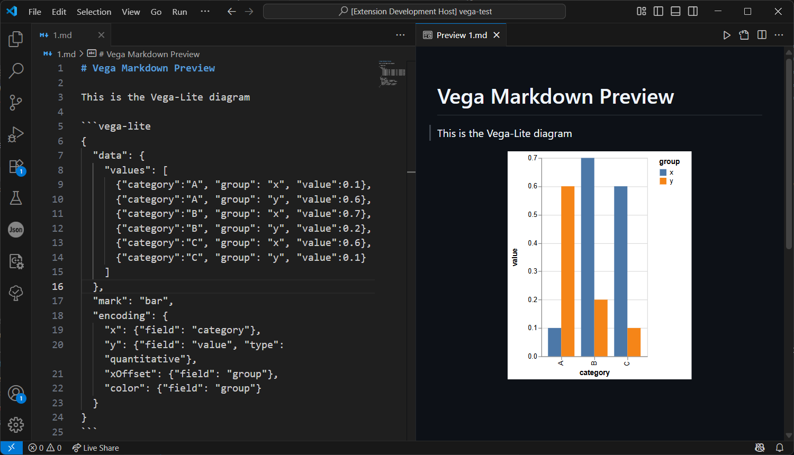

# Markdown Vega Preview

This is a Visual Code Extension that allows you preview **Vega/Vega-Lite diagrams in markdown preview**.

I sometimes want to draft my journal articles during my postgraduate study in markdown file. 🤔

But it costs me a lot of time to drawing Vega/Vega-Lite and embedding them into markdown. So I write this extension that allows me type the Vega or Vega-Lite specifications in markdown code blocks and previewing them in VSCode. That's the background of this project.

## Feature

Put the codeblock of language `vega` or `vega-lite` in markdown and preview them in VSCode.

````markdown
# Vega Markdown Preview

This is the **Vega-Lite** diagram

```vega-lite
{
  "data": {
    "values": [
      {"category":"A", "group": "x", "value":0.1},
      {"category":"A", "group": "y", "value":0.6},
      {"category":"B", "group": "x", "value":0.7},
      {"category":"B", "group": "y", "value":0.2},
      {"category":"C", "group": "x", "value":0.6},
      {"category":"C", "group": "y", "value":0.1}
    ]
  },
  "mark": "bar",
  "encoding": {
    "x": {"field": "category"},
    "y": {"field": "value", "type": "quantitative"},
    "xOffset": {"field": "group"},
    "color": {"field": "group"}
  }
}
```
````

Effect: 😍



Also, you can preview the Vega with its specification in same way.

## License

This project is under the MIT License © [但为君故](https://dreams.plus). **Welcome to contribute your ideas for this project.** 😀
